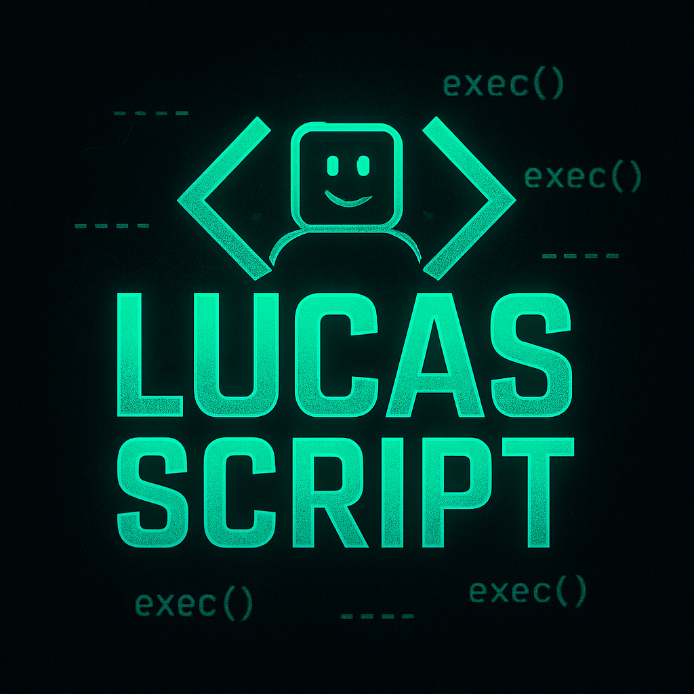

# Portal Combo - BloxFruits

## How to Use: *use with support aimbot (redzhub)*

Ensure the following equipment and mastery levels:

- **Gravity Blade**: 250+ Mastery  
- **Godhuman**: 350+ Mastery  
- **Portal**: 300+ Mastery  
- **Ghoul V3 or v4**
- **Use points in:** Sword
  
---

## Script - Portal Combo (PERFECT)

```lua
loadstring(game:HttpGet("https://github.com/Lucasggk/Create_macro_bloxfruits/raw/main/Portal.Loader.lua", true))()
```
---

# Ice Combo - BloxFruits

## How to Use: *use with support aimbot (redzhub)*

Ensure the following equipment and mastery levels:

- **Gravity Blade:** 350 Mastery
- **Godhuman:** 350 Mastery
- **Ice:** 100 Mastery **Skill "V" awk**
- **does not use race skills**
- **Use points in:** Sword

---

## Script - Ice Combo (PERFECT) | being redone 
```lua
loadstring(game:HttpGet("https://github.com/Lucasggk/Create_macro_bloxfruits/raw/main/Ice.Loader.lua", true))()
```
---

# Create your combo script

## how to use:

---
- **EquipUseHoldDelay("name of the item to equip", "skill to use", time holding the attack, time for next function**

exemple: **EquipUseHoldDelay("Godhuman", "C", 0.5, 1.7)**

explanation: he equips the item, uses the attack, holds the attack for a while, waits that long to switch to another function  
---
- **EquipUseDelay("Item name to equip", "Skill to use", time for next function)**

exemple: **EquipUseDelay("Ice-Ice", "V", 2.2)**

explanation: equip the item, use the attack, wait for the next function
---
- **UseSkillDelay("Skill to use", time for next function)**

exemple: **UseSkillDelay("Z", 1.3)**

explanation: Use the Skill, time for next function
---
- **EquipItem("Item name")**

exemple: **EquipItem("Portal-Portal")**

explanation: Equipe item
---
- **UseSkillPressDelay("skill to use ", time holding the attack, time for next function)**

exemple: **UseSkillPressDelay("C", 0.5, 1.7)**

explanation: holds the selected Skill for the selected time, time for next function  

- **raca()**
explanation: activate your race v3

- **EqSword("Sword name")**

exemple: **EqSword("Dual Cursed Katana")**

explanation: Equip the selected sword inside the quotes 

- **EqSword("Gun name")**

exemple: **EqGun("Skull Guitar")**

explanation: Equip the selected Gun inside the quotes 

- **EqStyle("Style name")**

exemple: **EqStyle("Godhuman")**

explanation: Equip the selected Style inside the quotes 
---
## how to config:

- put your ui name in:
**uiname = "your ui name"**


- put your combo in the script part:
 
**Button.MouseButton1Click:Connect(function()**

**--your combo script**

**end)**

```lua

loadstring(game:HttpGet("https://raw.githubusercontent.com/Lucasggk/Create_macro_bloxfruits/main/System2.0.lua"))()

local uiname = "your uiname"

for _, gui in pairs(game.CoreGui:GetChildren()) do
    if gui:IsA("ScreenGui") and gui:FindFirstChildOfClass("TextButton") and gui:FindFirstChildWhichIsA("TextButton").Text == uiname then
        gui:Destroy()
    end
end

local ScreenGui = Instance.new("ScreenGui", game.CoreGui)
local Button = Instance.new("TextButton", ScreenGui)

Button.Size = UDim2.new(0, 150, 0, 40)
Button.Position = UDim2.new(0.5, -60, 0.8, 0)
Button.Text = uiname
Button.BackgroundColor3 = Color3.fromRGB(50, 50, 50)
Button.TextColor3 = Color3.fromRGB(255, 255, 255)
Button.Font = Enum.Font.SourceSansBold
Button.TextSize = 20
Button.BorderSizePixel = 0
Button.BackgroundTransparency = 0.2
Button.Active = true
Button.Draggable = true

Button.MouseButton1Click:Connect(function()
    -- your combo script here
end)

```
